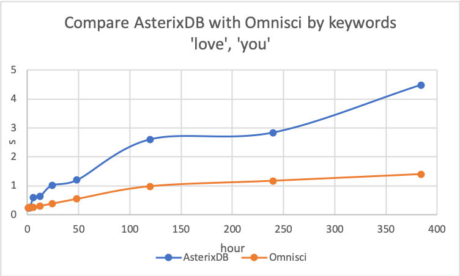

# AsterixdbEval
Evaluation of Asterixdb compared to Omnisci

# Machine
AWS P2.XLARGE GPU Instance

- 1 NVIDIA K80 GPU, 4 vCPU, 61 RAM(GiB)，11.75 ECUs
- NVIDIA K80 GPU
  - 4992 NVIDIA CUDA Cores
  - 24GB memory
  - 480 GB/s aggregate memory bandwidth 
- Price
  - 0.900 $/hour
  - 21.6 $/day
  
# Omnisci Database Architecture

Hybrid compute architecture that utilizes GPU, CPU and storage. When queries are executed, the Core database optimizer utilizes GPU RAM first if its available. The database will cache hot data. If GPU RAM is filled or unavailable, it will utilizes CPU RAM then SSD. The COPY FROM command that used for loading data into Omnisci will loads the data into the database's disk memory. The database only moves the data and columns on which the queries are asking to CPU or GPU.

# Data File

- AsterixDB
  - AsterixDB is an object database. It supports ADM and Json file format
- Omnisci
  - Omnisci is a relational database. It supports CSV and TXT file format

The experiment uses 20 million tweets data (22GB in ADM or Json format). In order to load data to Omnisci, I convert the Json file into CSV format by using python library Json. 

# Queries

AsterixDB provides inverted index based key word search while Omnisci only supports like statement for string matching function. Here we focus on comparing AsterixDB keyword search, ftcontains statement, with Omnisci like statement because AsterixDB like statement is too slow. For the same queries while AsterixDB keyword search and Omnisci like statement runs in million seconds, AsterixDB like statement needs to take more than ten seconds.

## sample queries
- AsterixDB keyword search using ftcontains
  - select t.`id` as `id`,t.`coordinate` as `coordinate`,
t.`place`.`bounding_box` as `place.bounding_box`
from twitter.ds_tweet t
where t.`create_at` >= datetime('2015-11-25T00:00:00.000') 
and t.`create_at` < datetime('2015-11-27T00:00:00.000') and 
ftcontains(t.`text`, ['hurricane'], {'mode':'all'}) and 
t.`geo_tag`.`stateID` in [ 37,51,24,11,10,34,42,9,44,48,
35,4,40,6,20,32,8,49,12,22,28,1,13,45,5,47,21,29,54,17,
18,39,19,55,26,27,31,56,41,46,16,30,53,38,25,36,50,33,23,2 ];
- AsterixDB like statement
  - select t.`id` as `id`,t.`coordinate` as `coordinate`,
t.`place`.`bounding_box` as `place.bounding_box`
from twitter.ds_tweet t
where t.`create_at` >= datetime('2015-11-25T00:00:00.000') 
and t.`create_at` < datetime('2015-11-27T00:00:00.000') and 
t.`text` like '%hurricane%' and 
t.`geo_tag`.`stateID` in [ 37,51,24,11,10,34,42,9,44,48,
35,4,40,6,20,32,8,49,12,22,28,1,13,45,5,47,21,29,54,17,
18,39,19,55,26,27,31,56,41,46,16,30,53,38,25,36,50,33,23,2 ];
- Omnisci like statement
  - Select t.id as id, t.coordinate as coordinate, 
t.place_bounding_box as bounding_box 
from ds_tweets as t 
where t.create_at >= '2015-11-25T00:00:00.000' 
and t.create_at < '2015-11-27T00:00:00.000' 
and t.text_ like '%hurricane%' 
and t.geo_tag_stateID in (37,51,24,11,10,34,42,9,44,48,35,4,40,6,20,32,8,49,
12,22,28,1,13,45,5,47,21,29,54,17,18,39,19,55,26,27,31,
56,41,46,16,30,53,38,25,36,50,33,23,2);

## Queries Performance

|Query|AsterixDB-keyword search|Omnisci-like statement|AsterixDB-like statement|
| --- | --- | --- | --- |
|Query by keyword wildfire|0.174s|0.317s|11.335s|
|Query by keyword hurricane|0.156s|0.152s|11.459s|

# Evaluation

The date range of 20 million tweets data span between 11/18/2015 to 12/04/2015, totally 384 hours. 

1. AsterixDB performs better when using a cheaper query. Query by keyword hurricane returns less than 1000 rows within the whole date range. AsterixDB only takes around 0.1 seconds to perform the queries while Omnisci needs 0.4 seconds for running. (Both databases are tested on P2.XLARGE instance)

2. Omnisci performs better when using a more expensive query. Query by keyword love returns 110,000 rows within the whole date range. Omnisci's performance is quite stable within the date range. AsterixDB shows an increasing trend as time increase. (Both databases are tested on P2.XLARGE instance)

3. Since AsterixDB uses inverted index for keyword search, it's more effective when searching for multiple keywords. Omnisci focus on fast scan performance but the running time increases when more keyword needs to be scanned.

Starting from two keywords, AsterixDB starts reducing its running time. It reduces half amount of time as searching by a single keyword love. Omnisci still runs faster than AsterixDB but does not show a trend of optimizing.

Starting from three keywords, AsterixDB only takes around 0.2 seconds to perform the queries. It performs much quicker than Omnisci. 

Searching for 4 keywords shows a similiar trend as 3 keywords. AsterixDB still takes around 0.2 seconds to perform the queries, much faster than Omnisci. 

# Optimizing AsterixDB

1. Since AsterixDB only uses CPU, it does not utilize the GPU provided from P2.XLARGE instance. We can use other instances that does not provide GPU but with other similiar CPU settings for running AsterixDB. I choose another two instances R4.XLARGE and R4.2XLARGE for testing. They are both cheaper than P2.XLARGE, the GPU instance but provides more ECUs and CPUs. 

|Instances|ECUs|vCPUs|GHz|processor|memory|price|
| --- | --- | --- | --- | --- | --- | --- |
|P2.XLARGE|11.75|4|2.7|Intel Broadwell E5-2686v4|61|0.900$/hour|
|R4.2XLARGE|26.8|8|2.3|Intel Broadwell E5-2686v4|61|0.532 $/hour|
|R4.XLARGE|13.4|4|2.3|Intel Broadwell E5-2686v4|30.5|0.266 $/hour|

R4.2XLARGE will peform better than the GPU instance when executing a cheaper query while R4.XLARGE performs the worst among the three instances.

R4.2XLAGR has a really similiar performance with the GPU instance when executing an expensive query. From this experiment, we can see that the cost for running AsterixDB is lower than Omnisci since it doesn't need GPU. We can choose a cheaper instance and has a similiar performance as the GPU instance. 

2. Since setting up a cluster is only available for Omnisci Enterprise version, we can set up a cluster of instances to optimize AsterixDB performance. I set up a cluster of two R4.2XLARGE and four R4.XLARGE instances which cost similiar price as a GPU instance. 

|Instance|Price|ECUs|vCPUs|memory|
| --- | --- | --- | --- | --- |
|P2.XLARGE|0.9 $/hour|11.75|4|61|
|1 R4.2XLARGE|0.532 $/hour|26.8|8|61|
|2 R4.2XLARGE|1.064 $/hour|53.6|16|122|
|4 R4.XLARGE|1.064 $/hour|53.6|16|122|

Since for cheaper queries like query by keyword hurricane, AsterixDB already performs better than Omnisci, It's unnecessary to increase cost to set up a cluster for testing cheaper queries. For expensive queries, more nodes help with the performance by providing greater processing power. Both two nodes and four nodes perform better than the single node. 

3. Using two inverted index, keyword index and create_at index

A “keyword index” is constructed on a set of strings or sets (e.g., OrderedList, UnorderedList). We generate tokens (e.g., words) and for each token, construct an inverted list that includes the ids of the objects with this token. That generally helps with improving the performance. 

Two indexes, keyword index and create_at index, may not be effective in this case. The database will look up full text index text_idx first. In that results, it needs to get both full-text index results and time range index results, then intersect the two results. Finally, look up for primary ID of the results. With two indexes, it needs to search for the database twice and get the intersection. For some cases, the cost maybe over the possible benefits it can get. Also, for searching a longer period of time, one index already needs to scan all the results one by one. Two indexes double the running time because it needs to scan the database twice. 

Example for a cheaper query:

Example for an expensive query:

